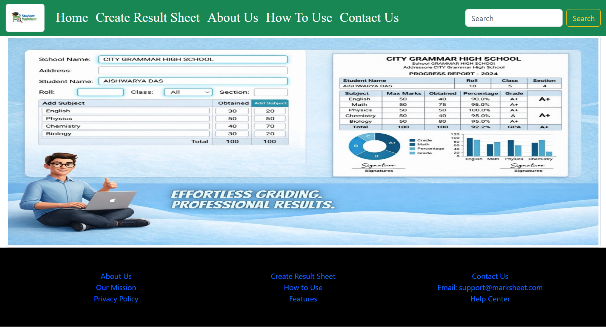
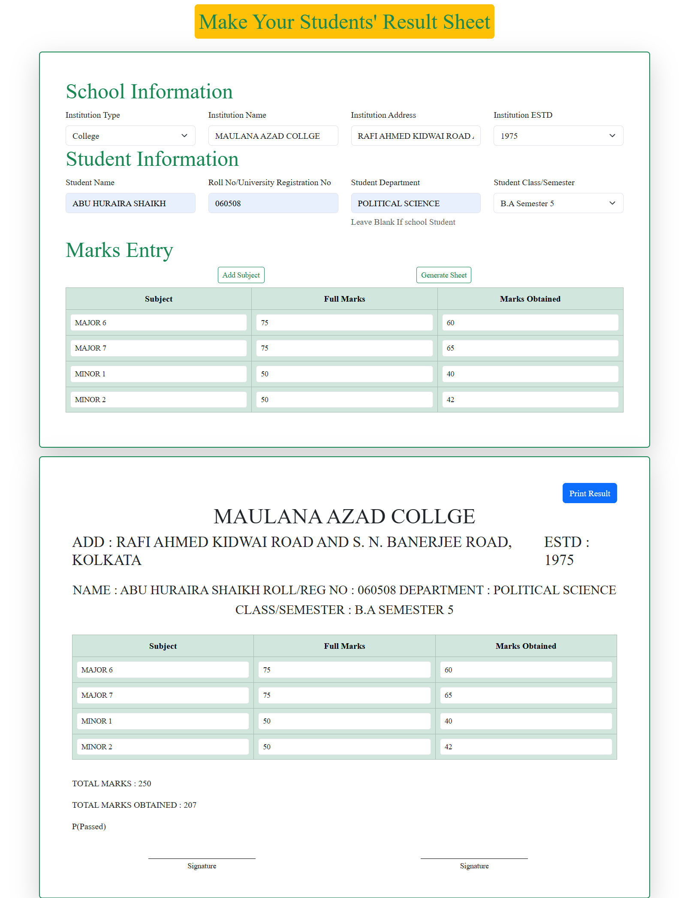
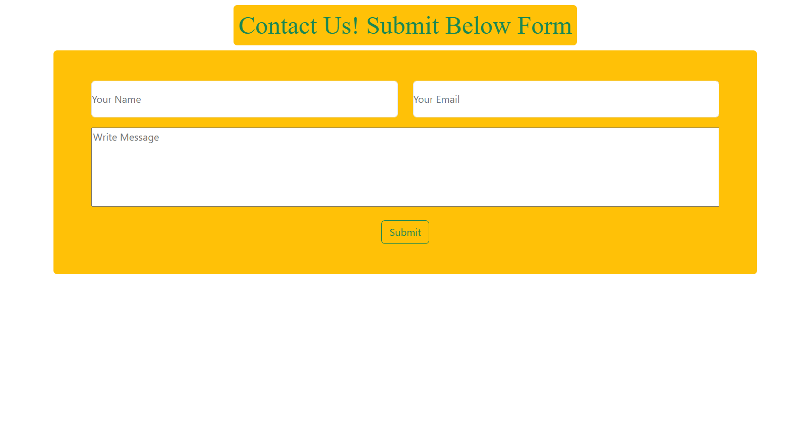

<h1 align="center">🎓 Student Result Sheet Generator</h1>

A simple, clean, and free web-based tool to create student result sheets and print them instantly.

<h2>🚀 Features</h2>

<ul>
  <li>📄 Create professional result sheets</li>
  <li>➕ Add subjects dynamically</li>
  <li>🧮 Automatic total calculation</li>
  <li>🎯 Pass / Fail detection</li>
  <li>🖨️ Print-ready (A4 optimized)</li>
  <li>📱 Fully responsive design</li>
  <li>📬 Contact form integration</li>
</ul>

<h2>🖥️ Project Preview</h2>

  

  

  

<h2>🛠️ Technologies Used</h2>

<ul>
  <li>HTML5</li>
  <li>CSS3</li>
  <li>Bootstrap 5</li>
  <li>JavaScript (Vanilla)</li>
</ul>

<h2>📂 Project Structure</h2>

<pre>
📁 project-folder
│── index.html
│── creat.html
│── contact.html
│── thankyou.html
│── style.css
│── index.js
│── photo/
</pre>

<h2>⚙️ How It Works</h2>

<ol>
  <li>Enter institution and student details</li>
  <li>Add subjects and marks</li>
  <li>Click <b>Generate Sheet</b></li>
  <li>View result instantly</li>
  <li>Print using <b>Print Button</b></li>
</ol>

<h2>📬 Contact</h2>

Contact form is integrated using Formspree (no backend required).

<h2>📌 Installation</h2>

<pre>

git clone https://github.com/developer-abu/marksheet.git

</pre>

Then open <b>index.html</b> in your browser.

<h2>📜 License</h2>

MIT License

<h2>🙌 Author</h2>

<b>Abu Huraira Shaikh</b>

<h2>📌 Live Link</h2>

<pre>

https://marksheetgenerator-blond.vercel.app/

</pre>

 
<h2>⭐ Support</h2>

If you like this project, give it a ⭐ on GitHub!

